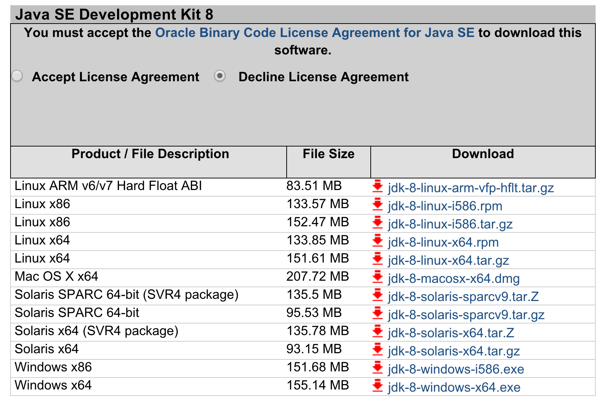
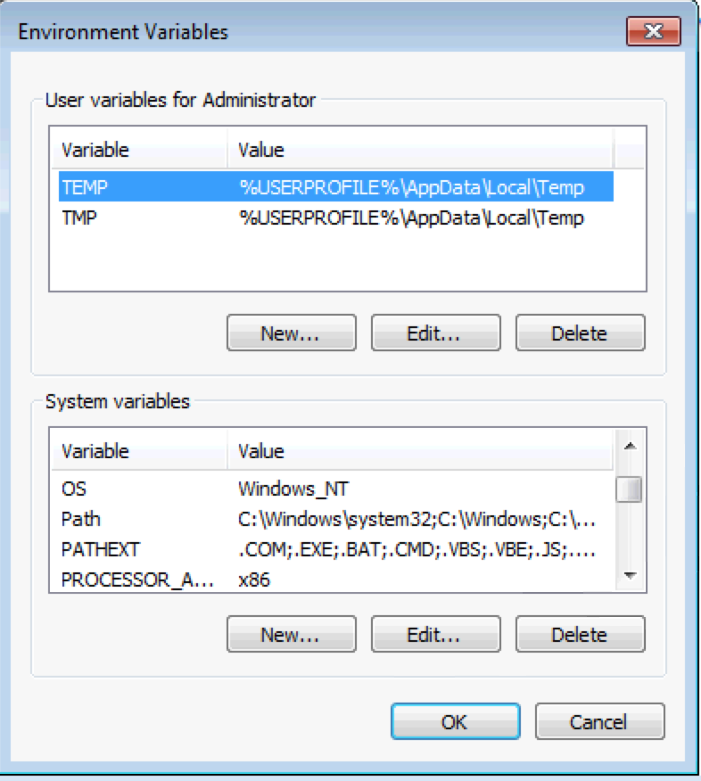
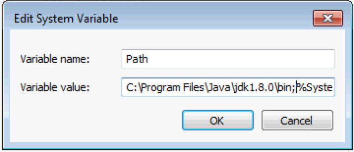
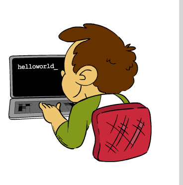
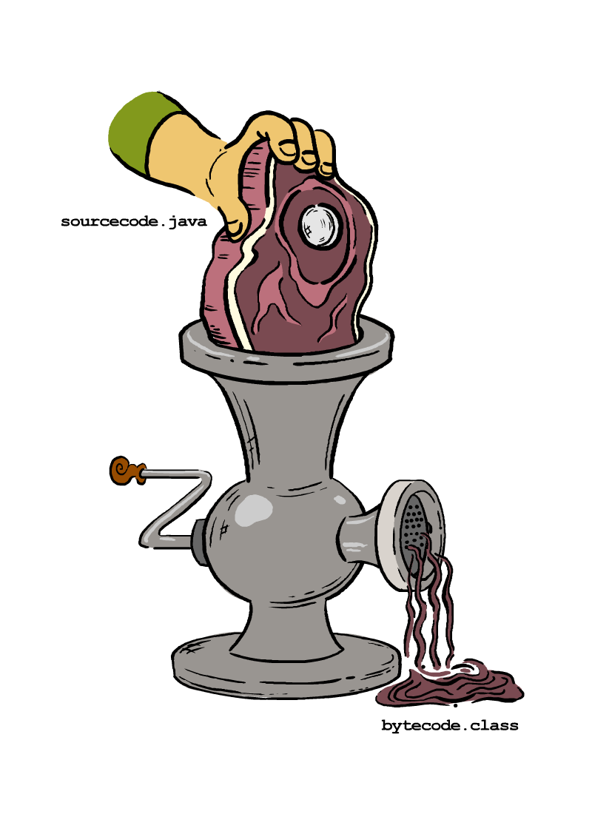
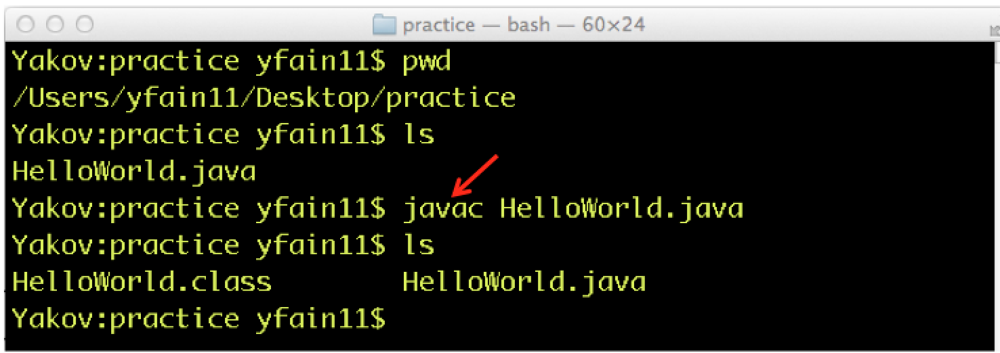
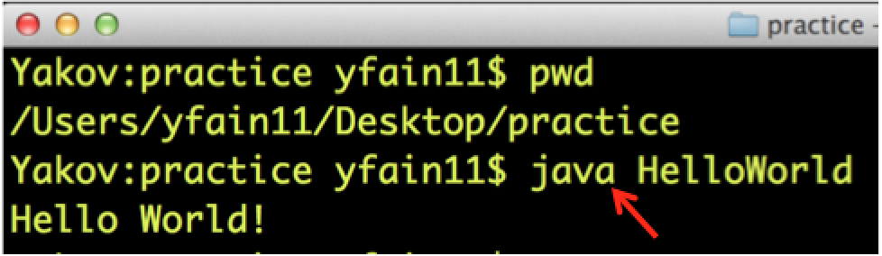

:toc-placement!:
:imagesdir: .

== Глава 1. Ваша первая программа на языке Java

В наши дни люди все больше времени тратят на общение с компьютерами, смартфонами или планшетами, нежели с другими людьми. Уже стало обычным делом, когда мы говорим друг другу: "Я установил классное приложение, которое может делать и то и другое". То есть, для взаимодействия с компьютерной техникой люди используют приложения или, по-другому, программы. И ведь кто-то написал эти приложения! Так вот, того кто пишет приложения для компьютеров обычно называют программистом или разработчиком программного обеспечения.

Программисты пишут различные приложения, например, игры, калькуляторы или текстовые редакторы. Без приложений компьютеры, смартфоны или игровые приставки для большинства людей будут абсолютно не нужны. Любое компьютерное устройство обычно уже имеет установленную операционную систему такую, как Windows, Mac OS, iOS или Android. Однако давайте представим смартфон без приложений или компьютер, который может показывать только логотип операционной системы. Кому будут нужны такие устройства? 

Программисты создают приложения с помощью различных языков программирования, например, с помощью Java, Python, C++, JavaScript, C или множества других языков. Некоторые из этих языков хорошо подходят для разработки маленьких программ, для которых требуется совсем небольшое количество памяти и которые могут быть зашиты прямо в компьютерные микросхемы. Другие языки программирования отлично справляются с программами для Интернет. Эти программы запускаются в интернет-браузерах. Еще есть языки для программ, работающих на больших серверах и обслуживающих тысячи пользовательских запросов. Даже есть языки, которые заточены для создания прекрасных графических изображений. Также как и языки, на которых говорят люди, языки программирования имеют наборы слов (их часто называют ключевыми словами) и правила использования этих слов (это - синтаксис).

С помощью этой книги вы изучите синтаксис языка Java, который может использоваться для разработки наибольшего количества типов приложений. На протяжении многих лет язык программирования Java является одним из самых популярных в мире языков. В то время, когда я пишу эти строки, в мире насчитывается более десяти миллионов профессиональных Java-программистов. Что же делает этот язык таким популярным?

В первую очередь это то, что одна и та же Java-программа может выполняться на различных устройствах: на настольных компьютерах под управлением Windows или MacOS, на смартфонах или планшетах. Собственно говоря, для Java-программам не имеет значения на каком именно устройстве они запущены, потому что они выполняются в виртуальной среде, которая называется виртуальной машиной. О виртуальной машине Java мы поговорим немного позже.

Java может быть встроена в маленькие микросхемы, которые контролируют работу различной бытовой техники или промышленных устройств. Например, такие микросхемы как те, что управляют умными домами, где отопление или освещение может быть запрограммировано удаленно с помощью телефона. Любые вещи, имеющие соединение с Интернет, могут программироваться на языке Java.

Некоторые языки программирования могут иметь общие принципы построения программ. Язык Java мы называем объектно-ориентированным. Его программные элементы (_классы_) представляют объекты реального мира. Например, вы можете создать класс под названием `Car` и определить для него атрибуты, присущие настоящей машине: двери, колеса и так далее. Затем вы можете создать другой класс на основе класса `Car`. Пусть это будет класс `Tesla`, который обладает всеми свойствами класса `Car` (двери, колеса) плюс электромотор.

Еще можно добавить, что программное обеспечение, необходимое для написания Java-программ бесплатно. Также в мире есть огромное количество профессиональных программистов на Java. Вы сможете найти массу примеров, а если вы столкнетесь с проблемой, вы всегда сможете найти решение на каком-нибудь популярном интернет-форуме, например, на http://stackoverflow.com[Stack Overflow]. Будьте уверены, кто-нибудь точно ответит.

Однако хватит рассуждать! Давайте начнем изучать Java.

=== Процесс установки Java на Ваш компьютер.

Чтобы начать программировать на Java вы должны загрузить Java Development Kit (JDK) с сайта компании, которая называется Oracle и выпускает новые версии и обновления языка Java. Полное наименование программного обеспечения, которое вам нужно будет загрузить, - Java SE Development Kit. Мы загрузим Java SE 8. Это самая последняя версия языка Java, доступная на момент написания этой книги. Для этого просто нужно зайти на сайт http://www.oracle.com/technetwork/java/javase/downloads/jdk8-downloads-2133151.html[Oracle]. Далее нужно принять условия лицензионного соглашения и выбрать ссылку, соответствующую операционной системе на вашем компьютере.

Обратите внимание: Если программистам необходим JDK, установленный на их компьютер, то пользователям вашего приложения придется установить Java Runtime Environment (JRE) на их собственные машины. JRE входит в состав JDK, но также может быть загружен как самостоятельный пакет.

[[FIG1-1]]
.Выбор версии Java SE 

Если вы используете операционную систему Windows, то загрузите файл под названием _jdk-8-windows-i586.exe_. Так как я работаю с компьютером Apple, на котором установлена операционная система Mac OS X, то в моем случае будет использоваться файл _jdk-8-macosx-x64.dmg_ в качестве установочной программы. Итак, запустите установочную программу, примите все ответы по умолчанию на заданные установщиком вопросы (для этого просто жмите кнопку Далее). Теперь вы почти готовы к работе.

В операционной системе Mac OS язык Java устанавливается в папку _/Library/Java/JavaVirtualMachines/jdk1.8.0.jdk_ (скорее всего после нуля будут еще цифры, которые обозначают номер обновления). На компьютерах, работающих под Windows язык Java будет установлен в _c:\Program Files\Java\jdk1.8.0_, где _c:_ имя вашего жесткого диска или SSD. Если вы используете Mac OS, то для вас установка завершена.

==== Еще несколько замечаний специально для пользователей Windows

Если вы используете Windows, вам обязательно необходимо добавить путь к папке Java в переменную окружения `Path`. Для этого щелкните кнопку Пуск, в меню выберите Панель управления, далее Система и найдите список _Environment Variables_. Вы увидите все системные переменные, которые есть в вашей операционной системе. Примерно такие как показаны на рисунке <<FIG1-4>>. Если у вас есть права администратора, вы можете установить переменные, которые будут применяться только тогда, когда определенный пользователь авторизуется на вашем компьютере или переменные, которые применяются для всех пользователей системы.

[[FIG1-4]]
.Windows OS - System Variables

Нажмите кнопку _Edit_ внизу списка и добавьте папку _bin_ JDK в начало значения переменной `Path`. Например, добавьте _c:\Program Files\java\jdk1.8.0\bin;_ если именно в эту папку установлен JDK на вашем компьютере.

[[FIG1-5]]
.Adding the bin directory Path variable
  

Теперь установка JDK на компьютере с операционной системой Windows завершена. Я уверен, что вам не терпится начать писать вашу первую программу. Ну так давайте сделаем это!

=== Три главных этапа в процессе программирования на Java

Если вам захочется _что-нибудь_ запрограммировать, то, скорее всего, вам потребуется выполнить друг за другом три шага:

. _Написать_ текст программы и сохранить его в файл.

. _Скомпилировать_ программу для того, чтобы перевести ее с языка Java в специальный _байт код_, который понятен для JVM.

. _Запустить_ программу.

==== Командная строка

В этой главе мы скомпилируем и запустим программу Hello World в окне командной строки, если у вас Windows, или в терминале, если у вас Mac OS.

В Windows, чтобы открыть окно командной строки нужно щелкнуть на кнопке _Пуск_, найти команду меню _Выполнить_ и ввести сочетание букв _cmd_ в поле под названием _Открыть_. На Mac, откройте окно _Spotlight_. Для этого нужно щелкнуть на иконке с лупой в правом верхнем углу экрана. Теперь нужно набрать слово _Terminal_ и нажать клавишу _Return_ на клавиатуре.

Для начала, создадим папку, которая будет называться _practice_. Это делается с помощью команды _mkdir practice_.

В этой папке мы будем сохранять все наши проекты на языке Java.

==== Шаг первый - Написание программы.

Начиная со второй главы мы будем использовать специальное приложение, которое называется Integrated Development Environment (IDE), для того, чтобы писать, компилировать и запускать программы. Однако пока, для лучшего понимания о том как все работает, давайте будем использовать простой редактор для текстовых файлов (это может быть Notepad, TextEdit или любой другой редактор). В нем мы сможем набрать нашу первую программу и сохранить ее в текстовом файле с расширением _.java_.

[[FIG1-8]]
.Ввод текста программы. 
 

Например, если вы хотите написать программу, которая называется `HelloWorld`, наберите следующий текст в любом редакторе. Вот текст программы, которая выводить слова _Hello World!_ на экран вашего компьютера.

[source, java] 
----
public class HelloWorld{

    public static void main(String[] args){

       System.out.println("Hello World!");
    
    }
}
----  

Сохраните этот программный код в файл _HelloWorld.java_ в папке _practice_. Учтите, что нельзя использовать пробелы в именах файлов Java.

Чуть позже в этой главе я объясню как эта программа работает. Ну а теперь, если вы ввели текст без опечаток, то программа напечатает на экране слова _Hello World_. Но произойдет это только тогда, когда мы закончим работу на шаге три.

Программисты обычно используют слова _исходный код_, чтобы обозначить текст программы. Так что можно с уверенностью сказать, мы писали исходный код программы Hello World. Однако, пока вы не станете опытным программистом вы не сможете с первого взгляда определить правильно ли написан текст программы. А сейчас давайте перейдем к изучению второго шага в процессе программирования.

==== Шаг второй - Компиляция программы.

Теперь вам надо использовать компилятор Java, чтобы перевести исходный год программы Hello World в байт-код понятный для JRE. Программа под названием _javac_ является компилятором Java. Эта программа установлена на вашем компьютере вместе с JDK и располагается в папке  _bin_.

[[FIG1-10]]
.Компиляция исходного кода. 

С помощью команды _cd practice_ установите текущей директорией папку _practice_. Если вы прежде никогда не использовали команду _cd_, прочитайте инструкцию о том как это делать в операционной системе http://www.wikihow.com/Change-Directories-in-Command-Prompt[Windows] или на http://blog.teamtreehouse.com/introduction-to-the-mac-os-x-command-line[Mac]. Теперь скомпилируйте программу с использованием следующей команды. 

_javac HelloWorld.java_

Если вы не увидели никаких сообщений, это значит, что ваша программа скомпилирована успешно. То есть, отсутствие сообщений означает, что никаких проблем при компиляции не возникло. Наберите команду _dir_ в Windows или команду _ls_ в Mac OS. Вы уведите список файлов в папке  _practice_. Вот как это выглядит в терминале на Mac OS.

[[FIG1-11]]
.Успешаня компиляция программы Hello World.

Сначала я ввел команду _pwd_, чтобы убедиться, что я нахожусь в папке _practice_. Здесь вы видите новый файл, который называется `HelloWorld.class`. Это подтверждает, что программа скомпилирована успешно. Ваш собственный файл `HelloWorld.java` точно также должен находится в этой папке.

Если программа содержит синтаксические ошибки, например, вы забыли напечатать последнюю закрывающуюся скобку, компилятор Java выведет на экран сообщение об ошибке. Следовательно, теперь вам нужно исправить ошибку и скомпилировать программу снова. Если есть несколько ошибок, то вам придется повторить эти действия несколько раз прежде чем файл `HelloWorld.class` будет создан.

==== Шаг третий - запуск программы.

Ну а сейчас давайте запустим программу. В том же самом окне командной сроки или в терминале введите:

_java HelloWorld_

После запуска этой команды вы уведите текст _Hello World!_, как это показано на рисунке <<FIG1-12>>. Обратили ли вы внимание, что вы использовали программу _java_, а не _javac_? Таким образом запускается JRE с передачей имени программы, которую нужно выполнить (в данном случае это `HelloWorld`).

[[FIG1-12]]
.Запуск программы HelloWorld.

Учтите, что Java не воспринимает прописные и строчные буквы как одинаковые. Это значит, что если программа названа `HelloWorld`, где буквы `H` и `W` прописные, то не нужно пытаться запустить программу `helloworld` или `helloWorld` – JRE при этом выдаст ошибку. Имя файла должно совпадать с именем класса. Обычно каждый файл иходного кода вашего приложения содержит единственный класс.

Теперь давайте немного развлечемся и попытаемся догадаться, как можно изменять программу, печатающую Hello World. Я подробно объясню, как именно работает программа в следующей главе, однако сейчас давайте попробуем догадаться что нужно сделать, чтобы поприветствовать вашего домашнего питомца, вашего друга или как распечатать ваш домашний адрес. Пройдите все три шага заново и убедитесь в том, что ваша программа продолжает корректно работать. Если у вас нет домашнего питомца, вы можете поприветствовать моего щенка - его зовут Sammy. Вы готовы справиться с заданием и сделать так, чтобы программа написала на экране фразу "Hello Sammy"?

[[FIG1-07]]
.Щенок Sammy. Ему 4 года.

В следующей главе вы узнаете, как писать, компилировать и запускать программы с использованием более продвинутых средств, чем простой текстовый редактор и командная строка.