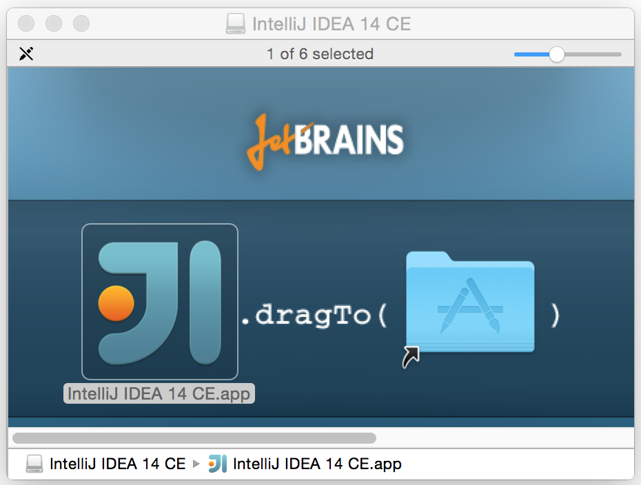
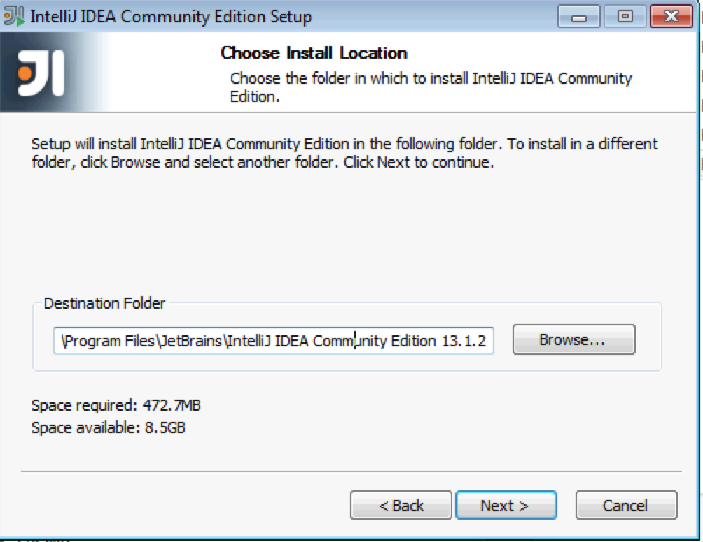
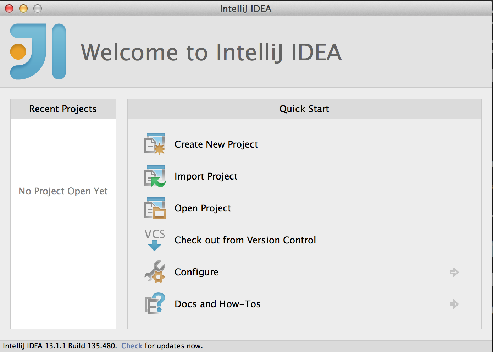
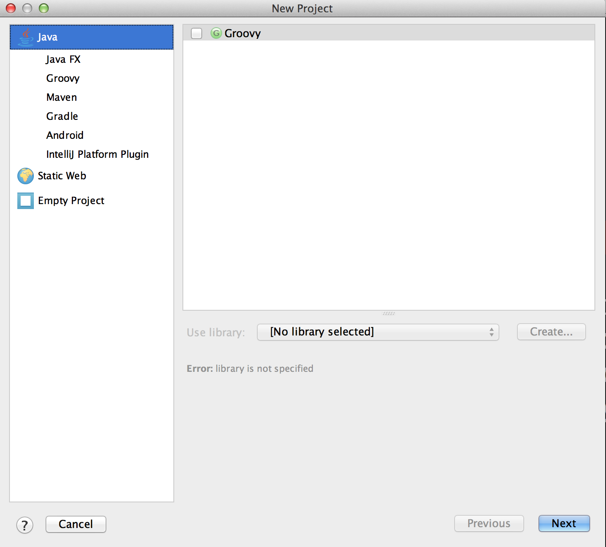
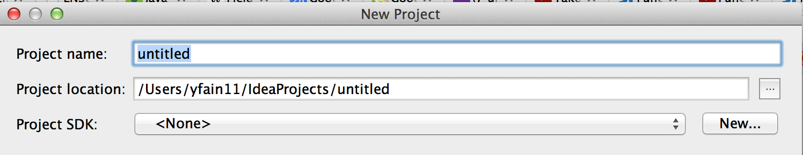

:toc-placement!:
:imagesdir: .

== Комфортное программирование в IDEA IDE

Большинство программистов пишут, компилируют и запускают свои приложения в специальных редакторах, которые называются интегрированная среда разработки (_Integrated Development Environment_ или _IDE_). Любая IDE помогает вам набирать текст, она подсвечивает _ключевые слова _Java_, в ней есть меню Помощь, где описаны все элементы языка. IDE также облегчает поиск и исправление ошибок в ваших программах. Вот несколько отличных IDE, которые можно использовать бесплатно. Самые популярные это http://www.eclipse.org/downloads/[Eclipse], https://netbeans.org/downloads/[NetBeans] и  http://www.jetbrains.com/idea/download/[IntelliJ IDEA]. В этой книге мы будем использовать IntelliJ IDEA Community Edition. Это превосходная IDE для разработки Java приложений. Если позже вы решите написать программу на каком-нибудь другом языке, знайте, что IDEA поддерживает http://www.jetbrains.com/idea/webhelp/supported-languages.html[более десятка] других языков.

Эту главу мы начнем с того, что загрузим и установим IntelliJ IDEA IDE (давайте будем называть ее просто IDEA). Затем мы создадим проект под названием `Hello`. Вы убедитесь, что создать приложение Hello World в IDEA будет намного проще.

=== Установка IntelliJ IDEA

Есть две версии IDEA IDE - Ultimate и Community. Версия Ultimate платная, но в ней есть много очень удобных и полезных дополнительных функций для разработчиков программного обеспечения для крупных предприятий. Однако эта книга об изучении основ языка Java, поэтому нам достаточно возможностей, которые предоставляет Community версия.

Откройте интернет-страницу http://www.jetbrains.com/idea/download/[IntelliJ IDEA] и щелкните по кнопке _Download Community_. После этого будет загружена установочная программа, название которой начинается с _ideaIC_. Просто запустите эту программу. Под MAC OS установочная программа не задают никаких дополнительных вопросов. Нужно всего лишь перетащить ее иконку в папку Applications.

[[FIG2-0-0]]
.Установка IDEA под MAC OS.
 

В операционной системе Windows вам понадобится выбрать папку, в которую будет установлена IDEA, так, как это показано ниже. Установочная программа под Windows также предложит создать ярлык для IDEA на рабочем столе - согласитесь с этим предложением.

[[FIG2-0]]
.Выбор папки для установки IDEA под Windows.

Через несколько секунд после щелчка на кнопке Next вы получите установленную на вашем компьютере IDEA. Если вы используете MAC OS, найдите ее с помощью Spotlight и запустите. В Windows щелкните по вновь созданному ярлыку на рабочем столе. Прежде всего IDEA спросит вас о необходимости импортировать настройки из старых версий. Пропустите этот шаг. После этого появится экран приветствия.

[[FIG2-1]]
.Добро пожаловать в IntelliJ IDEA Community Edition.
  

=== Создание вашего первого проекта.

В IDEA ваши Java приложения будут представлять собой отдельные проекты. Как вы, видимо, уже догадались вам нужно будет выбрать команду _Create New Project_ на экране. После этого IDEA попросит выбрать тип проекта, который вы хотите создать.

[[FIG2-2]]
.Выбор типа проекта.

  
Выберите опцию для создания Java проекта. В IDEA проекты состоят из модулей. Выбор Java указывает, что наш проект будет состоять из Java модулей. Нажмите кнопку Next. В следующем окне вам будет задан вопрос о выборе шаблона, который будет использоваться в проекте. Теперь нам нужно дать имя нашему проекту и выбрать версию JDK для проекта.

[[FIG2-3]]
.Выбор имени проекта и версии JDK.

Естественно, мы не хотим, чтобы наш проект назывался _untitled_, поэтому поменяйте в верхнем текстовом поле это имя на _hello_. Учтите, что имя папки в поле расположения проекта будет изменено соответственно. Когда вы будете выполнять эти действия на своем компьютере, расположение проекта, скорее всего, будет отличаться от моего. Теперь вам нужно выбрать версию JDK. Если вы никогда ранее не работали с Java, то у вас установлена единственная версия JDK. Ее мы установили в прошлой главе. Хотя, у Java-программистов иногда бывает так, что на компьютере установлено несколько версий JDK. Например, когда они не могут использовать последнюю версию JDK 8 для рабочих проектов, тогда они используют JDK 7, но свои домашние или исследовательские проекты они могут выполнять с использованием JDK 8.

У нас нет подобных проблем, поэтому наш единственный выбор - это JDK 8. Теперь попытаемся выяснить, где он располагается.

Щелкните на кнопке New, выберите команду меню _JDK_ и вы увидите знакомое окно выбора папок. Пожалуйста, вернитесь к первому разделу первой главы (_Процесс установки Java на Ваш компьютер._)

