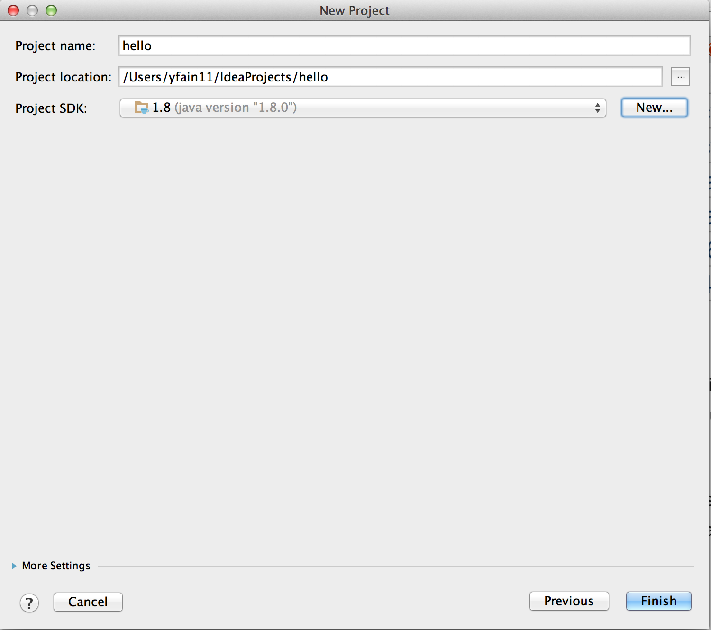
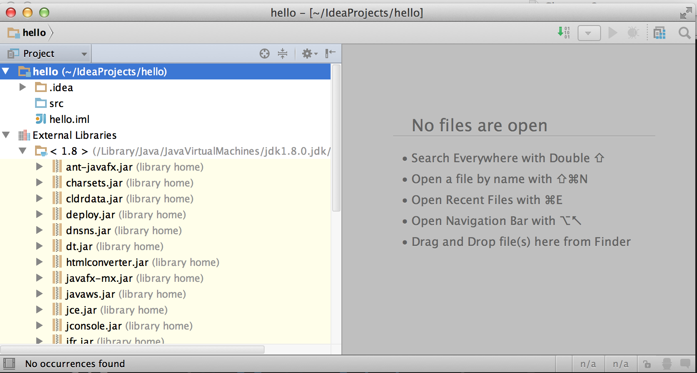
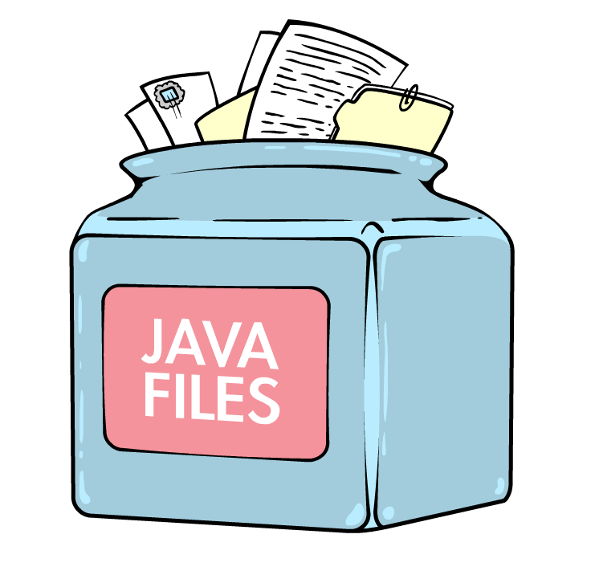
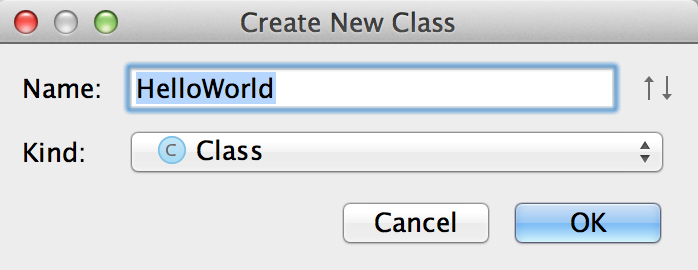
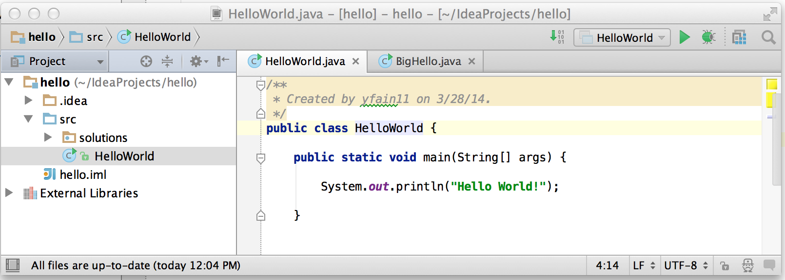
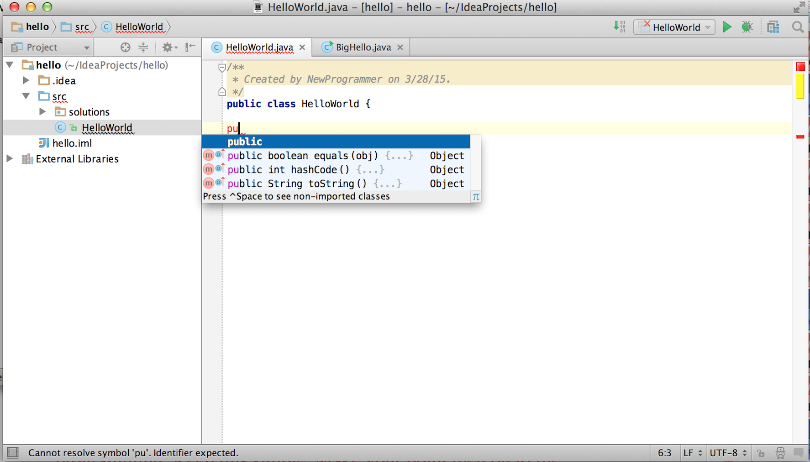
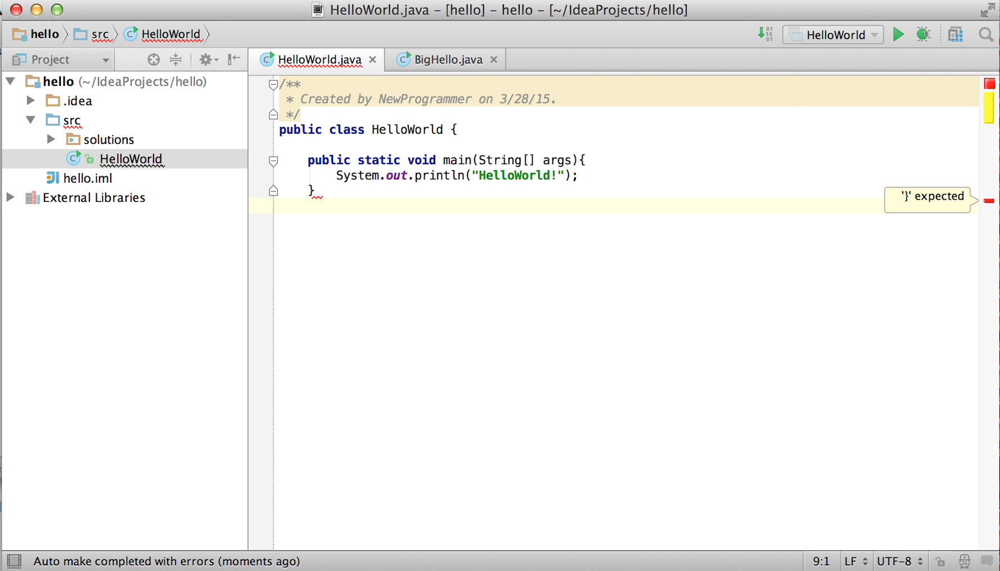

:toc-placement!:
:imagesdir: .

== Комфортное программирование в IDEA IDE

Большинство программистов пишут, компилируют и запускают свои приложения в специальных редакторах, которые называются интегрированная среда разработки (_Integrated Development Environment_ или _IDE_). Любая IDE помогает вам набирать текст, она подсвечивает _ключевые слова Java_, в ней есть меню Помощь, где описаны все элементы языка. IDE также облегчает поиск и исправление ошибок в ваших программах. Вот несколько отличных IDE, которые можно использовать бесплатно. Самые популярные это http://www.eclipse.org/downloads/[Eclipse], https://netbeans.org/downloads/[NetBeans] и  http://www.jetbrains.com/idea/download/[IntelliJ IDEA]. В этой книге мы будем использовать IntelliJ IDEA Community Edition. Это превосходная IDE для разработки Java приложений. Если позже вы решите написать программу на каком-нибудь другом языке, знайте, что IDEA поддерживает http://www.jetbrains.com/idea/webhelp/supported-languages.html[более десятка] других языков.

Эту главу мы начнем с того, что загрузим и установим IntelliJ IDEA IDE (давайте будем называть ее просто IDEA). Затем мы создадим проект под названием `Hello`. Вы убедитесь, что создать приложение Hello World в IDEA будет намного проще.

=== Установка IntelliJ IDEA

Есть две версии IDEA IDE - Ultimate и Community. Версия Ultimate платная, но в ней есть много очень удобных и полезных дополнительных функций для разработчиков программного обеспечения, работающих над большими проектами для крупных предприятий. Однако эта книга об изучении основ языка Java, поэтому нам достаточно возможностей, которые предоставляет Community версия.

Откройте интернет-страницу http://www.jetbrains.com/idea/download/[IntelliJ IDEA] и щелкните по кнопке _Download Community_. После этого будет загружена установочная программа, название которой начинается с _ideaIC_. Просто запустите эту программу. Под MAC OS установочная программа не задают никаких дополнительных вопросов. Нужно всего лишь перетащить ее иконку в папку Applications.

[[FIG2-0-0]]
.Установка IDEA под MAC OS.
image::images/fig_2_install_idea_mac.png[] 

В операционной системе Windows вам понадобится выбрать папку, в которую будет установлена IDEA, так, как это показано ниже. Установочная программа под Windows также предложит создать ярлык для IDEA на рабочем столе - согласитесь с этим предложением.

[[FIG2-0]]
.Выбор папки для установки IDEA под Windows.
image::images/fig_2_00.png[]

Через несколько секунд после щелчка на кнопке Next вы получите установленную на вашем компьютере IDEA. Если вы используете MAC OS, найдите ее с помощью Spotlight и запустите. В Windows щелкните по вновь созданному ярлыку на рабочем столе. Прежде всего IDEA спросит вас о необходимости импортировать настройки из старых версий. Пропустите этот шаг. После этого появится экран приветствия.

[[FIG2-1]]
.Добро пожаловать в IntelliJ IDEA Community Edition.
image::images/fig_2_01.png[]  

=== Создание вашего первого проекта.

В IDEA ваши Java приложения будут представлять собой отдельные проекты. Как вы, видимо, уже догадались вам нужно будет выбрать команду _Create New Project_ на экране. После этого IDEA попросит выбрать тип проекта, который вы хотите создать.

[[FIG2-2]]
.Выбор типа проекта.
image::images/fig_2_02.png[]
  
Выберите опцию для создания Java проекта. В IDEA проекты состоят из модулей. Выбор Java указывает, что наш проект будет состоять из Java модулей. Нажмите кнопку Next. В следующем окне вам будет задан вопрос о выборе шаблона, который будет использоваться в проекте. Теперь нам нужно дать имя нашему проекту и выбрать версию JDK для проекта.

[[FIG2-3]]
.Выбор имени проекта и версии JDK.
image::images/fig_2_03.png[]

Естественно, мы не хотим, чтобы наш проект назывался _untitled_, поэтому поменяйте в верхнем текстовом поле это имя на _hello_. Учтите, что имя папки в поле расположения проекта будет изменено соответственно. Когда вы будете выполнять эти действия на своем компьютере, расположение проекта, скорее всего, будет отличаться от моего. Теперь вам нужно выбрать версию JDK. Если вы никогда ранее не работали с Java, то у вас установлена единственная версия JDK. Ее мы установили в прошлой главе. Хотя, у Java-программистов иногда бывает так, что на компьютере установлено несколько версий JDK. Например, когда они не могут использовать последнюю версию JDK 8 для рабочих проектов, тогда они используют JDK 7, но свои домашние или исследовательские проекты они могут выполнять с использованием JDK 8.

У нас нет подобных проблем, поэтому наш единственный выбор - это JDK 8. Теперь попытаемся выяснить, где он располагается.

Щелкните на кнопке New, выберите команду меню _JDK_ и вы увидите знакомое окно выбора папок. Пожалуйста, вернитесь к первому разделу первой главы (_Процесс установки Java на Ваш компьютер._) с учетом того, какой операционной системой вы пользуетесь. Так как я использую MAC,  я выбираю _Library_, _Java_, _JavaVirtualMachines_, _jdk1.8.0.jdk_. Убедитесь, что окно выбора версии JDK теперь выглядит иначе.

[[FIG2-4]]
.Версия JDK выбрана.

Нажмите кнопку Finish и ваш новый проект будет создан. Каждый раз, когда вы запускаете IDEA, она дает вам небольшие советы о том, как лучше использовать классный функционал этой системы. Вы можете отказаться от этих советов, но я рекомендую все-таки читать их. Возможно вы сможете найти какие-нибудь небольшие изюминки, которые сделают работу в IDEA еще более приятной.

Проект _hello_ готов к работе и вы можете начинать писать свою программу Hello World.

[[FIG2-5]]
.Проект hello.

Этот проект содержит модуль hello и ссылки на внешние библиотеки (External Libraries). Исходный код вашей программы будет располагаться в папке src в модуле hello. Файл _hello.iml_ - это то место, где IDEA сохраняет настройки проекта hello. Никогда не изменяйте это файл самостоятельно. В разделе External Libraries вы сможете найти кучу файлов с расширением _.jar_. Эти JAR-ы - библиотеки программного кода, поставляемые вместе с JDK.

Простой проект, вроде нашего проекта `HelloWorld`, будет иметь только один файл с исходным кодом - _HelloWorld.java_. Более сложные проекты, обычно, состоят из множества файлов. Чтобы облегчить установку приложения на пользовательские машины, все эти файлы будут упакованы в один или несколько JAR-ов. Как JRE, так и Java SDK содержат десятки файлов JAR. Java поставляется вместе с программой, которая используется для упаковки файлов Java и других файлов в файл с расширением .jar. Формат файлов .jar идентичен формату файлов архиватора .zip. Если ваш IDEA проект будет иметь множество классов, вы сможете упаковать их в один единственный JAR с помощью команды JAR, которая находится в меню File | Project Structure | Artifacts.

[[FIG2-5-1]]

=== Создание класса HelloWorld в IDE IDEA.

Программы на Java состоят из _классов_. Что такое классы вы узнаете позже в разделе "Как работает программа Hello World". Давайте еще раз создадим класс `HelloWorld` такой же, как в первой главе, но уже в IDE IDEA. Укажите папку _src_ в своем проекте и выберите меню File | New | Java Class. Вы увидите диалоговое окно, в котором нужно указать имя класса. В этом окне наберите `HelloWorld`.

[[FIG2-6]]
.Ввод имени класса.

После этого IDEA сгенерирует пустой класс `HelloWorld` так, как показано ниже. Белая область справа - это очень умный текстовый редактор, который позволяет не только вводить текст программы, но и подсказывает вам что именно нужно набирать. Это по-настоящему умный редактор. 

[[FIG2-7]]
.Пустой класс HelloWorld.

Текст, заключенный между символами `/\**` и `*/`, это одни из способов написания комментариев к своим программам. Здесь вы можете набрать любой текст, которые описывает работу всей программы в целом или какого-нибудь специфического участка кода внутри класса. Различные способы комментирования кода мы обсудим в следующей главе. 

==== Добавление метода main в программу

Пришло время добавить в класс метод main. Точно также, как мы это сделали в первой главе.

`public static void main(String[] args)`

Как только вы приступите к набору определения метода main, приведенного выше, IDEA послушно начнет помогать вам. Например, когда я стал набирать слово `public` и ввел буквы `pu` IDEA предложила список ключевых слов, подходящих для данного участка кода внутри класса.

[[FIG2-8]]
.Автоматическое завершение кода.

Нажатие клавиши _Tab_ на клавиатуре автоматически превратит `pu` в `public`. Вы также всегда можете нажать сочетание клавиш _Control-Space_, чтобы в любой момент просмотреть список возможных вариантов завершения кода. Но есть еще более быстрый способ ввода определения метода main. Просто наберите первые буквы всех ключевых слов и нажмите клавишу _Tab_. IDEA развернет эти буквы в следующий программный код:

[source, java]
----
public static void main(String[] args) {

}
----

Молодец, IDEA! Благодаря такому автоматическому завершению кода минимизируется ручной ввод текста. Вам нужно делать гораздо меньше нажатий клавиш. В конце этой главы есть раздел Дополнительные Материалы, в котором вы найдете ссылку на веб-страницу с описанием более продвинутых возможностей IDEA по завершению кода. Возможно еще не все будет вам понятно, но все-таки внесите это страницу в закладки вашего браузера. Она пригодится вам в будущем.

Совет: Чтобы стать настоящим профессионалом IDEA, вы должны научиться использовать _горячие клавиши_. Это такие сочетания клавиш на клавиатуре. С помощью "горячих" клавиш вы сможете перемещаться по вашему проекту в IDEA намного быстрее, чем просто щелкая по пунктам меню. Ссылку на документ, содержащий список "горячих клавиш", вы найдете в конце главы в разделе Дополнительные Материалы.

Теперь у нас есть класс `HelloWorld` с пустым _методом_ `main`. Слово _метод_ обозначает какое-нибудь _действие_. Чтобы можно было запустить Java класс на исполнение как программу, этот класс должен иметь метод под названием `main`. Чаще всего, ваши приложения будут иметь множество классов, но только один из них будет иметь метод `main`. Этот класс будет считаться точкой входа в ваше  приложение.

Для завершения ввода текста программы установите курсор после фигурной скобки в строке со словом `main`, нажмите клавишу _Enter_ и наберите следующий текст на новой строке:

`System.out.println("Hello World!");`

Знание о команде `psvm` намекает, что есть аналогичный способ для ввода текста `System.out.println()`. Просто наберите `sout` и нажмите _Tab_. Вуаля! Сочетание букв `sout` магически превратилось в `System.out.println();`. Программисты на Java довольно часто используют вывод текста в консоль, поэтому создатели IDEA предусмотрели команду для данного случая.

Чтобы сохранить изменения в коде и скомпилировать класс, нажмите  _Ctrl-S_ на клавиатуре. Если вы не совершили синтаксических ошибок, то вы не увидите никаких сообщений в процессе компиляции программы. Однако давайте специально сделаем ошибку, чтобы посмотреть что из этого выйдет. Сотрите последнюю фигурную скобку в классе `HelloWorld` и снова нажмите _Ctrl-S_. IDEA подчеркнет волнистой чертой то место, где содержится ошибка, а справа от неверной строки появится красная метка. Если вы подведете указатель мыши к этому маленькому красному прямоугольнику, то вы увидите текст сообщения об ошибке. 

[[FIG2-9]]
.Ошибка, найденная компилятором.

